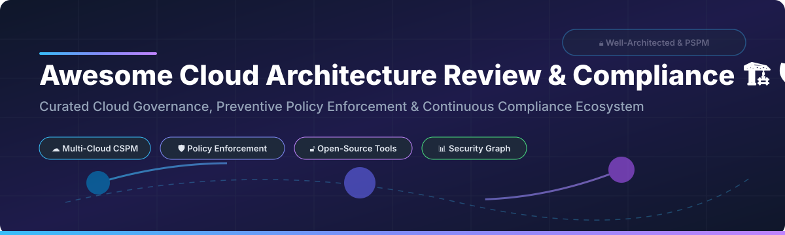

# Awesome-Cloud-Architecture-Review-Compliance

# Awesome-Cloud-Architecture-Review-Compliance 🏗️ 🛡️

  

  

  

  

  

  

  

---

## 🌟 Top Cloud Architecture Review & Compliance Ecosystem

**Curated List of Commercial Governance Platforms & Open-Source Architecture Assessment Tools**  

*Focused on Well-Architected Reviews, Preventive Policy Enforcement, Continuous Compliance Monitoring & Self-Hosted Assessment Engines*  

**Last updated: October 2026** 📅

---

### 📌 Overview & SEO Summary

Welcome to the ultimate curated directory of **cloud architecture review platforms**, **preventive policy enforcement engines**, and **continuous compliance monitoring frameworks**. Whether you are looking for enterprise-grade commercial solutions (such as *AWS Well-Architected Tool*, *Trend Micro Conformity*, and *Turbot Guardrails*), or self-hostable open-source alternatives (like *Prowler*, *ScoutSuite*, and *Clouditor*), this list covers category leaders, graph-based risk correlation, and privacy-respecting compliance automation.

---

## 📑 Table of Contents

- [🏢 SaaS & Commercial Platforms](#-saas--commercial-platforms)

- [🔓 Open-Source GitHub Projects](#-open-source-github-projects)

- [🛠️ How to Contribute](#%EF%B8%8F-how-to-contribute)

- [📊 Star History](#-star-history)

- [🤝 Support & Sponsorship](#-support--sponsorship)

- [⚠️ Disclaimer](#%EF%B8%8F-disclaimer)

---

## 🏢 SaaS / Commercial Platforms

The cloud architecture review and compliance market spans native cloud provider tools, preventive policy engines, and graph-based risk correlation platforms. **AWS Well-Architected Tool** is a free service that provides a consistent process for measuring architectures against AWS best practices across six pillars: operational excellence, security, reliability, performance efficiency, cost optimization, and sustainability . **Trend Micro Conformity** automates checks for approximately 1,000 cloud services across AWS, Azure, and Google Cloud, with real-time monitoring and auto-remediation capabilities . **Turbot Guardrails** introduced Preventive Security Posture Management (PSPM) in 2026, shifting from reactive detection to blocking risky changes before deployment, with prevention maturity scoring from Level 0 to Level 5 .

| SaaS / Commercial Platform | Company / Owner | Valuation / Market Cap | Standard Edition Starting Price | Free Tier / Free Trial Limits | Description |

| :--- | :--- | :--- | :--- | :--- | :--- |

| **[AWS Well-Architected Tool](https://aws.amazon.com/well-architected-tool/)** ☁️ | Amazon | ~$2.0 Trillion | **Free service** | **Free forever** | **AWS-native architecture review** — Documents workloads and measures them against the six-pillar Well-Architected Framework. **Custom lenses** allow organizations to codify internal best practices . Milestones track architectural evolution across design, testing, go-live, and production . |

| **[Trend Micro Cloud One Conformity](https://www.trendmicro.com/en_us/business/products/hybrid-cloud/cloud-one-conformity.html)** 🟠 | Trend Micro | ~$10 Billion | Custom per-cloud-account pricing | **Free trial available** | **Multi-cloud configuration scanning** — Checks ~1,000 cloud services against CIS, NIST, GDPR, PCI DSS, HIPAA, SOC2, ISO 27001, and AWS/Azure Well-Architected Frameworks . **Auto-remediation** via AWS Lambda integration fixes high-risk misconfigurations automatically . |

| **[Turbot Guardrails](https://turbot.com/guardrails)** 🛡️ | Turbot | Private | Custom enterprise pricing | **Free trial available** | **Preventive Security Posture Management (PSPM)** — Blocks risky changes **before** they reach production, not after . **Policy Simulator** tests changes against real CloudTrail data without production risk. **Prevention maturity scoring** (Level 0–5) against CIS and NIST benchmarks . |

| **[Bridgecrew (Prisma Cloud)](https://www.bridgecrew.io/)** 🟣 | Palo Alto Networks (Acquired) | ~$60 Billion | **Freemium**; Prisma Cloud custom pricing | **Free tier available** | **Security-as-code platform** — Identifies and **automatically fixes** cloud infrastructure misconfigurations in runtime and build-time . **Kubernetes scanning** via CronJob deployment with annotation-based suppression . Acquired by Palo Alto Networks for **$156M** in 2021 . |

| **[CoreStack](https://www.corestack.io/)** ⚙️ | CoreStack | Private | Custom enterprise pricing | **Free trial available** | **Agentic Governance OS** — Unified control plane across cloud, SaaS, and AI . **Compliance Assessment Reports** group by control category, severity, and resource type. Added **CIS AWS 5.0/6.0 and CIS GCP 4.0** in Release 5.3 . **3000+ policies**, **83 integrations**, **27 standards** supported . |

| **[Orca Security](https://orca.security/)** 🐋 | Orca Security | Private | Custom per-workload pricing | **Free trial available** | **Agentless-first CNAPP** — Unified platform across cloud infrastructure, workloads, identities, applications, and **AI systems** . **Threat Investigation Agent** produces transparent investigation reports. **Code Reachability Analysis** identifies whether vulnerable code paths are actually invoked. Strategic collaboration with AWS announced March 2026 . |

| **[Wiz](https://www.wiz.io/)** 🟣 | Google (Acquired) | ~$10 Billion | Custom enterprise pricing | **No free tier**; demo available | **Security graph for code-to-cloud context** — Named **Leader in Forrester Wave: Proactive Security Platforms, Q3 2026** with highest scores (5.0/5.0) in eight criteria including cloud visibility, application exposure, and remediation augmentation . **Wiz Green/Red/Blue agents** for automated code fixes, attack path discovery, and threat hunting . |

| **[Palo Alto Prisma Cloud (Cortex Cloud)](https://www.paloaltonetworks.com/prisma/cloud)** 🔴 | Palo Alto Networks | ~$60 Billion | Custom enterprise pricing | **Free trial available** | **Merged with Cortex CDR to form Cortex Cloud** — Real-time cloud security with AI-powered prioritization and automated remediation . **Compute Edition (self-hosted)** available for air-gapped environments and full data control . |

| **[Firefly](https://firefly.ai/)** 🪰 | Firefly | Private | Custom enterprise pricing | **Free trial available** | **Infrastructure-as-code management** — Scans **metadata and configurations only**, not workload data . **SOC 2 Type II certified**, ISO 27001 and GDPR aligned. **No customer data used for AI model training** . |

| **[Bionic](https://www.bionic.ai/)** 🦾 | CrowdStrike (Acquired) | ~$80 Billion | Custom enterprise pricing | **Demo available** | **Application Security Posture Management (ASPM)** — **No source-code access required** . Maps application services, databases, APIs, and data flows across cloud providers. **Dynamic SBOM** for compliance and supply chain detection. Acquired by CrowdStrike to extend code-to-runtime visibility . |

---

## 🔓 Open-Source GitHub Projects

*Sorted by GitHub_Stars_Count (Descending)* 🌟

- **[Prowler](https://github.com/prowler-cloud/prowler)**   

  **The most comprehensive open-source cloud security assessment tool**, Apache-2.0 licensed. **553 checks for AWS, 138 for Azure, 77 for GCP, 83 for Kubernetes** covering CIS, NIST 800, NIST CSF, PCI-DSS, GDPR, HIPAA, SOC2, and custom frameworks . **Prowler App** provides visual interface with compliance framework mapping. **Docker Compose deployment** available for self-hosted app. Outputs **OCSF v1.1.0 JSON** for standardized analytics. Runs from workstation, Kubernetes Job, EC2, Fargate, CloudShell, or any container . 🛡️

- **[ScoutSuite](https://github.com/nccgroup/ScoutSuite)**   

  **Multi-cloud security auditing tool**, GPL-2.0 licensed. Collects configuration data from cloud provider APIs and runs security checks against it. Identifies **publicly accessible S3 buckets, overly permissive IAM policies, unencrypted databases, and security groups with open ports**. **NCC Scout** SaaS version offers persistent monitoring with expanded service coverage. 🔍

- **[Clouditor](https://github.com/clouditor/clouditor)**   

  **Continuous cloud assurance and compliance monitoring**, Apache-2.0 licensed. **60+ checks for AWS, Azure, and OpenStack** evaluated against **BSI C5 and CSA CCM** security requirements. **Cloud Compliance Language (CCL)** for descriptive custom rule development. **Automated service discovery** integrates with existing infrastructure. 🎯

- **[Cloudsplaining](https://github.com/salesforce/cloudsplaining)**   

  **AWS IAM security assessment tool**, BSD-3-Clause licensed. **2,003 stars**. Identifies **violations of least privilege** and generates **risk-prioritized HTML reports**. Finds **actions with wildcards, data exfiltration risks, resource exposure risks, and privilege escalation** via IAM policies. **The standard tool for IAM policy auditing**. 🔐

- **[ArchiQ (Amazon Q Architecture Reviewer)](https://github.com/aws-samples/sample-q-architecture-reviewer)**   

  **Amazon Q-powered architecture analysis tool**, Apache-2.0 licensed. **Four analysis types**: security assessment, well-architected review, architecture diagram generation, and modernization path analysis . **Service Screener analysis** modes: review, SHIP (Security Health Improvement Program), and modernization. **English and Korean language support**. Generates HTML reports with timestamps . 🤖

- **[Cartography](https://github.com/lyft/cartography)**   

  **Infrastructure asset and relationship mapping**, Apache-2.0 licensed. **3,020 stars**. Consolidates infrastructure assets and relationships in an intuitive graph view powered by Neo4j. **Connects AWS, GCP, Azure, and SaaS sources** into a single queryable graph. Enables advanced security queries — "which S3 buckets are publicly accessible and what IAM roles can access them?" 🗺️

- **[CloudFox](https://github.com/BishopFox/cloudfox)**   

  **AWS cloud penetration testing tool**, Apache-2.0 licensed. Automating situational awareness for cloud penetration tests. **`all-checks`** runs comprehensive assessment with reasonable defaults. Specialized commands for **access keys, S3 buckets, cross-account privilege escalation paths (CAPE), CloudFormation stacks, RDS connection strings, EKS cluster exposure, environment variables, IAM policy simulation, Lambda functions, exposed network ports, organization accounts, and outbound assumed roles**. 🦊

- **[ElectricEye](https://github.com/Cloud-Red-Team/ElectricEye)**   

  **Multi-cloud security posture management**, Apache-2.0 licensed. **962 stars**. Python CLI tool for Asset Management, Security Posture Management & Attack Surface Monitoring across AWS, Azure, GCP, and SaaS. Continuous monitoring with automated remediation. 🔭

- **[Steampipe](https://github.com/turbot/steampipe)**   

  **Query cloud APIs with SQL**, AGPL-3.0 licensed. ~7k+ stars. **Zero-ETL approach** — query AWS, Azure, GCP, Kubernetes, and 100+ services directly. **Build custom compliance queries with SQL**. The simplest way to explore cloud configuration data without data pipelines. 🔗

- **[CloudQuery](https://github.com/cloudquery/cloudquery)**   

  **Cloud asset inventory and CSPM**, MPL-2.0 licensed. ~5k+ stars. **Extracts cloud configuration into PostgreSQL** for querying and analysis. Enables custom governance queries across multi-cloud environments. 📦

---

## 🛠️ How to Contribute

Contributions are welcome! Follow these steps to submit new cloud architecture review platforms or open-source compliance software:

1. 🍴 **Fork** the repository.

2. 📝 **Add/edit** entries in `README.md` maintaining table/list structure and formatting.

3. 🔗 Include project title, official website/GitHub link, exact Stars_Count, license, and brief description.

4. 🚀 Submit a **Pull Request** with a descriptive summary of your changes.

---

## 📊 Star History

---

## 🤝 Support & Sponsorship

If you find this cloud architecture review repository useful, please consider supporting the project:

- ⭐ **Star** this repository to increase visibility!

- 🔀 **Fork** and share with fellow cloud architects, security engineers, and open-source advocates.

- ☕ **Sponsor & Buy Me a Coffee**: Support ongoing open-source curation via the [GitHub Sponsor Dashboard](https://github.com/sponsors/ishandutta2007).

---

## ⚠️ Disclaimer

- This is a **community-curated** list — not exhaustive and not an endorsement. ℹ️

- **Firefly scans only metadata and configurations, not workload data** — no S3 bucket contents or VM file systems are accessed . **Bionic requires no source-code access** — it analyzes application behavior without source repositories .

- **Bridgecrew was acquired by Palo Alto Networks for $156M** and is now integrated into Prisma Cloud/Cortex Cloud . **Bionic was acquired by CrowdStrike** to extend code-to-runtime visibility .

- **Turbot Guardrails PSPM** shifts from reactive detection to **proactive prevention** — blocking risky changes before deployment rather than discovering them after .

- Open-source solutions (Prowler, ScoutSuite, Clouditor, ArchiQ) provide self-hosted ownership and transparency, but enterprise-grade SLA guarantees, managed infrastructure, and 24/7 support remain primarily commercial offerings. **Always validate findings against your specific compliance requirements** before acting. 🏗️

---

  <b>Made with ❤️ for cloud architects, security engineers, and open-source compliance advocates.</b>

